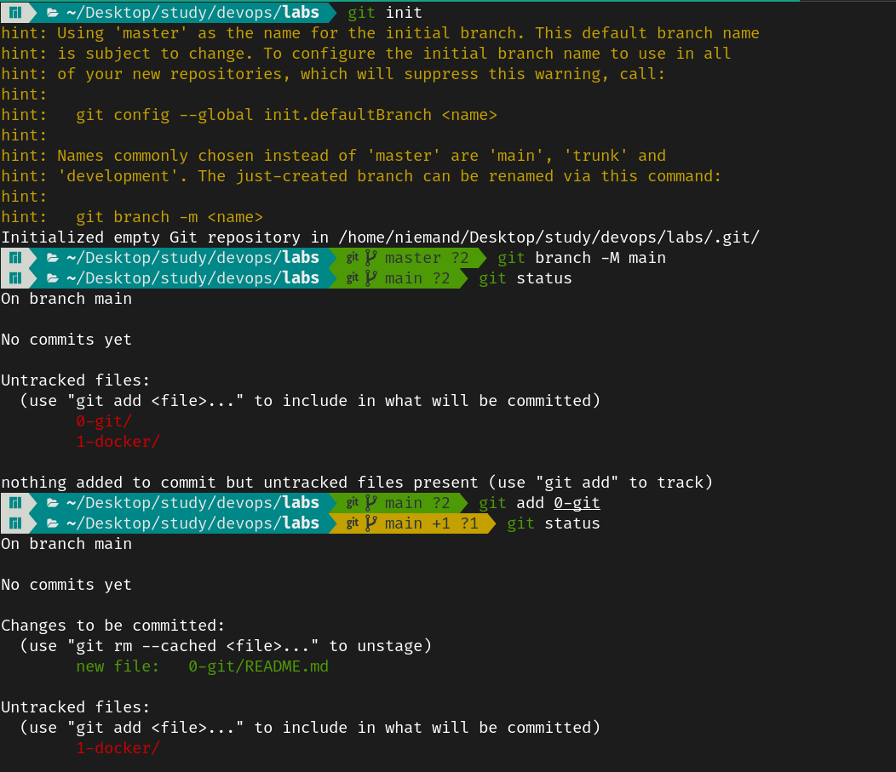
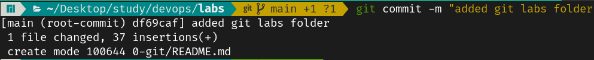

# Lab 1 → Git & GitHub

## Part 1

### Install and Configure Git
```sh
### Arch Linux

# Git is already installed
git version # git version 2.42.0

# Configure Git
git config --global user.name "my-user"
git config --global user.email "my.user@email.com"


## SSH Part - Create Github Account before
ssh-keygen -t ed25519 -C "my.user@email.com"
ssh-add ~/.ssh/id_github

## Add the content of ~/.ssh/id_github.pub to Github SSH Keys settings

## Test Connection
ssh -T git@github.com
```


### Initiate a Local Git Repository and use git add, git status, git commit and git log





### Create a Remote Repository and Sync the Local Repository


### Add a Collaborator to commit and pull his changes


## Part 2

### git branch, git checkout, git merge, git branch -d


### Merge conflicts and commit it to remote repository


### Propose a development flow (for example GitFlow) with versioning and tags
- We can have a `main` branch for the production environment
- We can have a `dev` branch for the development environment
- We can have a `release` branch for the release/staging environment
- For each User story, a seperate branch will be created for it
- We can have a `hotfix` branch for critical production bug fixes