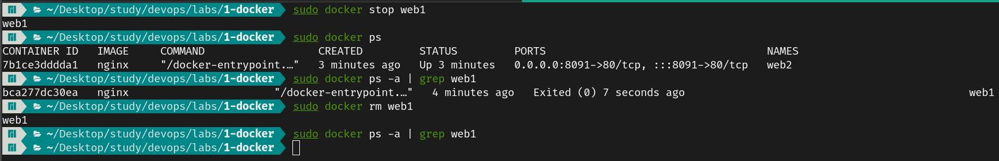
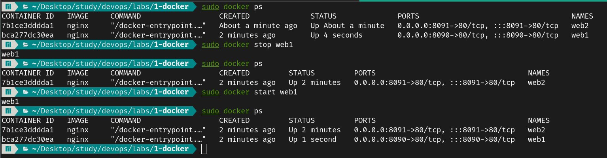
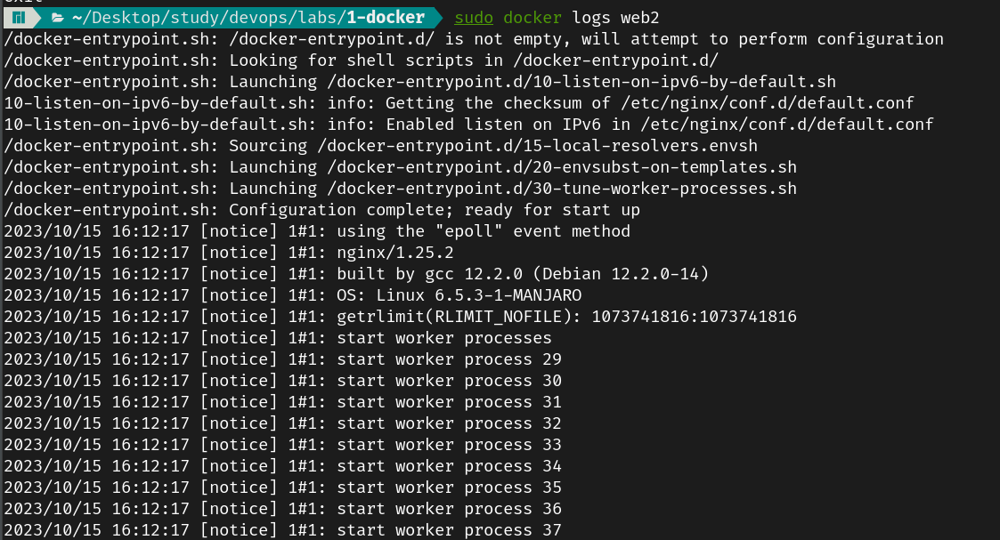
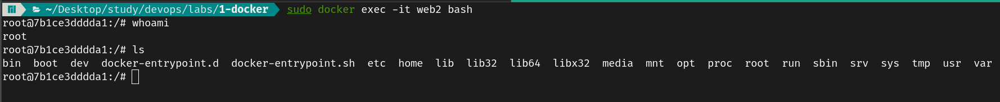
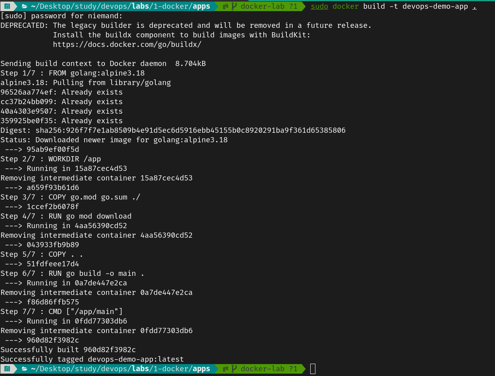

# Lab 2 → Docker

## Install Docker and setup dockerhub
```sh
# Arch Linux

# Setup Docker
sudo pacman -S docker
sudo systemctl start docker.service
sudo systemctl enable docker.service

# Setup Docker Compose
sudo pamac install docker-compose

# Login to DockerHub
sudo docker login
```

## Create 2 nginx containers, list, delete, stop..

### Run 2 `nginx` containers in both ports `8090` and `8091` and list them
- `-d` : for detached mode
- `-p HOST_PORT:CONTAINER_PORT` : bind the container port to the host machine port
- `--name CONTAINER_NAME` : name the container 


### Delete and Stop the containers
- Stop and Start the container (the container still exists but either running or not)


- Remove the container


- Check the Logs of the container


- Explore the content of the container



## Dockerize a web application and run it, check the layers and re-usability

For this scenario, we have created a simple Golang HTTP Server using the web framework [echo](https://echo.labstack.com). In golang the files `go.mod` and `go.sum` are responsible for managing the dependencies.
The Web app as a start just returns "Hello World" when you visit "http://localhost:1323".

The Dockerfile for the app is as follows:

```dockerfile
FROM golang:alpine3.18

# Initiate a folder for the project called app
WORKDIR /app

# Move the files that are responsible for installing the dependencies 
COPY go.mod go.sum ./

# Install the dependencies
RUN go mod download

# Move the rest of the files
COPY . .

# Build the project into an executable
RUN go build -o main .

# Run the executable
CMD ["/app/main"]
```
This is the output of building the image


- Run a database container and test the interaction
- Make the app as docker-compose 
- Using Docker in CI and Production best practices
- Create a Jenkins Pipeline to pull code from GitHub, build it, and push it to dockerhub
- Add another Jenkins Pipeline and use something else (maven, Ansible…) -let’s do snyk-