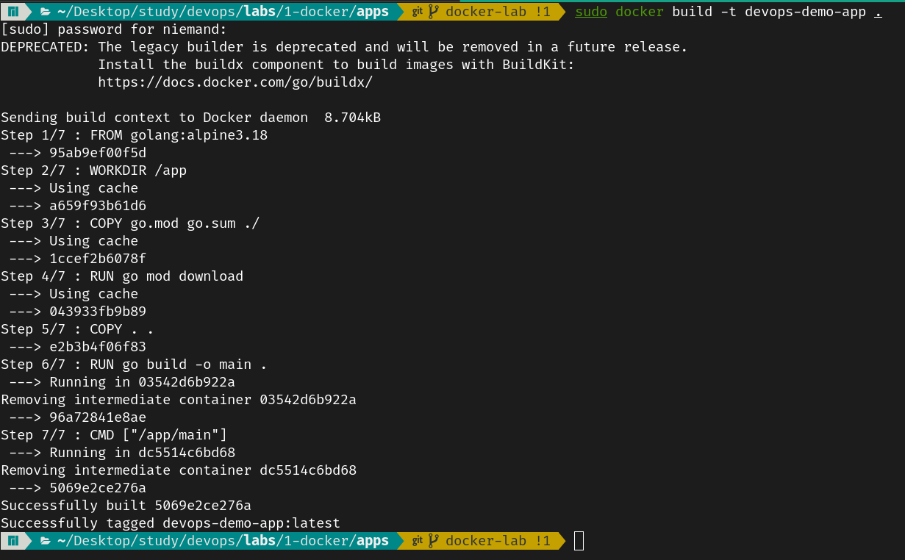
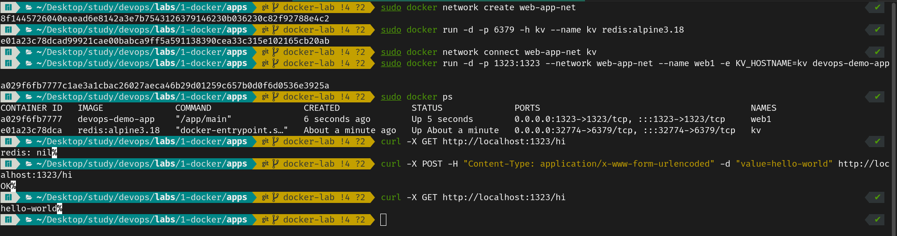
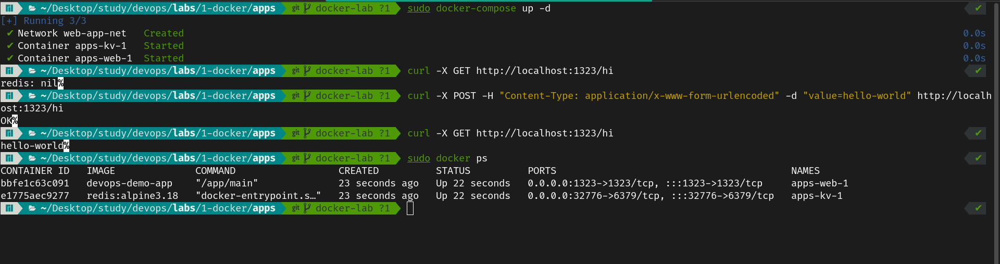

# Lab 2 → Docker

## Install Docker and setup dockerhub
```sh
# Arch Linux

# Setup Docker
sudo pacman -S docker
sudo systemctl start docker.service
sudo systemctl enable docker.service

# Setup Docker Compose
sudo pamac install docker-compose

# Login to DockerHub
sudo docker login
```

## Create 2 nginx containers, list, delete, stop..

### Run 2 `nginx` containers in both ports `8090` and `8091` and list them
- `-d` : for detached mode
- `-p HOST_PORT:CONTAINER_PORT` : bind the container port to the host machine port
- `--name CONTAINER_NAME` : name the container 


### Delete and Stop the containers
- Stop and Start the container (the container still exists but either running or not)


- Remove the container


- Check the Logs of the container


- Explore the content of the container


## Dockerize a web application and run it, check the layers and re-usability

For this scenario, we have created a simple Golang HTTP Server using the web framework [echo](https://echo.labstack.com). In golang the files `go.mod` and `go.sum` are responsible for managing the dependencies.
The Web app as a start just returns "Hello World" when you visit "http://localhost:1323".

The Dockerfile for the app is as follows:

```dockerfile
FROM golang:alpine3.18

# Initiate a folder for the project called app
WORKDIR /app

# Move the files that are responsible for installing the dependencies 
COPY go.mod go.sum ./

# Install the dependencies
RUN go mod download

# Move the rest of the files
COPY . .

# Build the project into an executable
RUN go build -o main .

# Run the executable
CMD ["/app/main"]
```
This is the output of building the image


When we change "Hello, World" to "Hello, There" and rebuild the docker image, the command `RUN go mod download` will be cached and the build will be faster, thanks to the layering system of docker.



### Run a database container and test the interaction
For this step, we have added a file called `kv.go` which has utilities to interact with **Redis**, an In-Memory Database. Next we changed the `main.go` file to add 2 routes, one to set a key-value pair and another to get the value of a key. The Redis hostname is passed as an environment variable to the container, called `KV_HOSTNAME`.

To simulate an interaction between 2 seperate containers, being the golang web server and an instance of Redis, we will use Docker network bridges. Here is how we have done it.


### Docker Compose
It is very obvious, that we have accomplished the previous response through running a lot of commands, and debugging it and changing anything will be a nightmare. So, we will use Docker Compose to automate the process and reduce the complexity and toil.
The same commands we have executed are equivalent to the following YAML file
```yaml
version: "3"

services:
  web:
    image: devops-demo-app
    ports:
      - 1323:1323
    environment:
      - KV_HOSTNAME=kv

  kv:
    image: redis:alpine3.18
    ports:
      - 6379

networks:
  default:
    name: web-app-net
```



- Using Docker in CI and Production best practices
- Create a Jenkins Pipeline to pull code from GitHub, build it, and push it to dockerhub
- Add another Jenkins Pipeline and use something else (maven, Ansible…) -let’s do snyk-