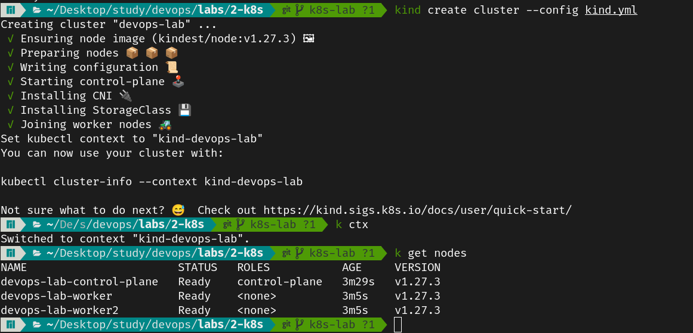
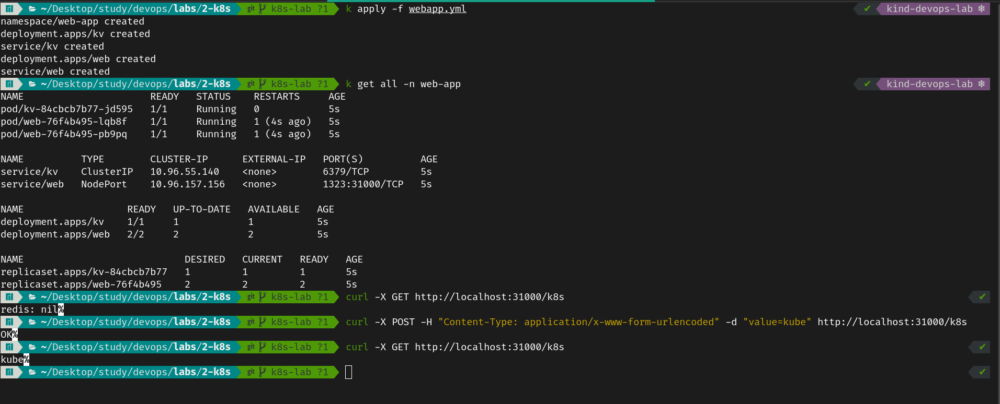
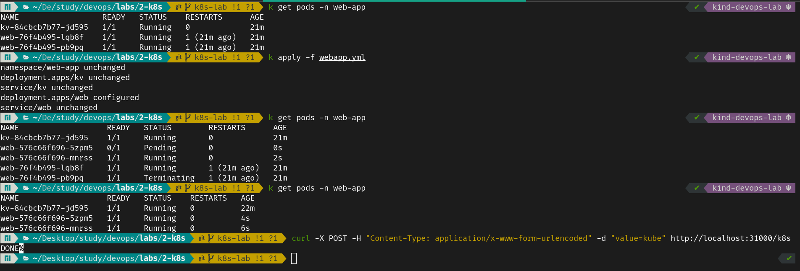

# Lab 3 → Kubernetes


## Create a Cluster
We can create a Kubernetes cluster using various methods, from `kubeadm`, `k3s`, `minikube`, `microk8s`, `kind` or any managed service. For this lab, we will use `kind` to create a cluster with 3 nodes. `kind` is easily configurable so we will use the following YAML file to create our cluster:

```yaml
kind: Cluster
apiVersion: kind.x-k8s.io/v1alpha4
name: devops-lab
nodes:
- role: control-plane
  extraPortMappings:
    - containerPort: 31000
      hostPort: 31000
- role: worker
- role: worker
```



## Deploy a web app on Kubernetes, and expose it
We will deploy the same application that we have made from the previous lab.
> We should load the docker image to the cluster nodes, as a requirement for `kind` to work.

```bash
kind load docker-image devops-demo-app -n devops-lab
```

We can deploy the application using `webapp.yml` file in the current directory. It contains the following:
- A namespace `web-app`
- A Deployment `web` with 2 replicas, with the strategy `RollingUpdate` and `maxSurge` and `maxUnavailable` being set
- A Service `web` that exposes the deployment on port `31000` for external access (NodePort)
- A Deployment `kv` with 1 replica (As a database, it would be more suited to use a StatefulSet, but since we are using a simple In-Memory database with no persistence, we can use a Deployment)
- A Service `kv` that exposes the deployment on port `6379` for internal access (ClusterIP)



When we update the response of one of the endpoints, from "OK" to "DONE", we update the image and apply the changes to the cluster. We can see that the pods are being updated one by one, and the app overall is still available.


## Monitoring

### Grafana and Prometheus
- We followed this [guide](https://grafana.com/docs/grafana-cloud/monitor-infrastructure/kubernetes-monitoring/configuration/configure-infrastructure-manually/prometheus/prometheus-operator/) to install Prometheus and Grafana on our cluster.

<!--
- Test Metrics and Logging with Any tools.
- Propose a CI/CD Pipeline that interacts with Kubernetes, DockerHub, Ansible… but we’re Cool so we’re doing ArgoCD -->