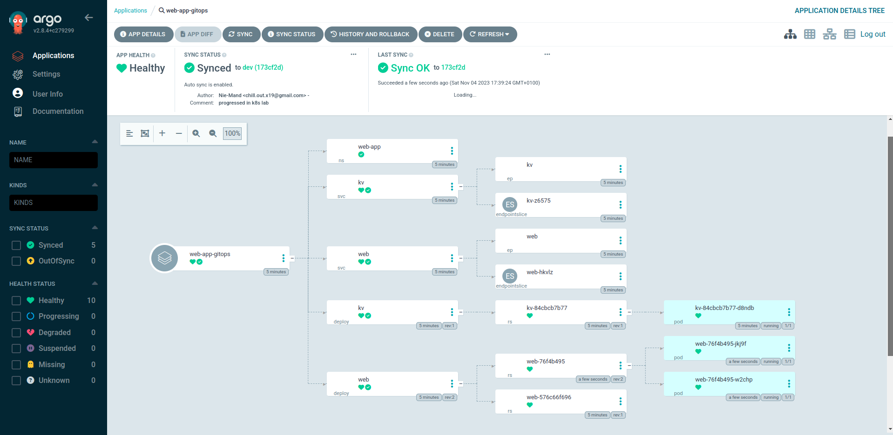

# Lab 3 → Kubernetes
> Prepared by Mohamed Sofiene Barka, Mohamed Rafraf, Jihene Ben Tekaya
> Note that in my examples I use `k` as an alias for `kubectl`

## Create a Cluster
We can create a Kubernetes cluster using various methods, from `kubeadm`, `k3s`, `minikube`, `microk8s`, `kind` or any managed service. For this lab, we will use `kind` to create a cluster with 3 nodes. 

> To install `kind` on our machine, follow this [guide](https://kind.sigs.k8s.io/).

`kind` is easily configurable so we will use the following YAML file to create our cluster:

```yaml
kind: Cluster
apiVersion: kind.x-k8s.io/v1alpha4
name: devops-lab
nodes:
- role: control-plane
- role: worker
- role: worker
```


## Deploy a web app on Kubernetes, and expose it
We will deploy the same application that we have made from the previous lab.
> We should load the docker image to the cluster nodes, as a requirement for `kind` to work.

```bash
kind load docker-image devops-demo-app -n devops-lab
```

We can deploy the application using `webapp.yml` file in the current directory. It contains the following:
- A namespace `web-app`
- A Deployment `web` with 2 replicas, with the strategy `RollingUpdate` and `maxSurge` and `maxUnavailable` being set (To avoid downtime when updating the application)
- A Service `web` that exposes the deployment on port `31000` for external access (NodePort)
- A Deployment `kv` with 1 replica (As a database, it would be more suited to use a StatefulSet, but since we are using a simple In-Memory database with no persistence, we can use a Deployment)
- A Service `kv` that exposes the deployment on port `6379` for internal access (ClusterIP)

```yaml
apiVersion: v1
kind: Namespace
metadata:
  name: web-app
---
apiVersion: apps/v1
kind: Deployment
metadata:
  name: kv
  namespace: web-app
spec:
  replicas: 1
  selector:
    matchLabels:
      app: kv
  template:
    metadata:
      labels:
        app: kv
    spec:
      containers:
        - name: kv
          image: redis:alpine3.18
          ports:
            - containerPort: 6379
---
apiVersion: v1
kind: Service
metadata:
  name: kv
  namespace: web-app
spec:
  selector:
    app: kv
  ports:
    - port: 6379
      targetPort: 6379
---
apiVersion: apps/v1
kind: Deployment
metadata:
  name: web
  namespace: web-app
spec:
  replicas: 2
  strategy: 
    type: RollingUpdate
    rollingUpdate:
      maxSurge: 1
      maxUnavailable: 0
  selector:
    matchLabels:
      app: web
  template:
    metadata:
      labels:
        app: web
    spec:
      containers:
        - name: web
          image: devops-demo-app
          imagePullPolicy: Never
          ports:
            - containerPort: 1323
          env:
            - name: KV_HOSTNAME
              value: kv
---
apiVersion: v1
kind: Service
metadata:
  name: web
  namespace: web-app
spec:
  type: NodePort
  selector:
    app: web
  ports:
    - port: 1323
      targetPort: 1323
      nodePort: 31000
```


When we update the response of one of the endpoints, from "OK" to "DONE", we update the image and apply the changes to the cluster. We can see that the pods are being updated one by one, and the app overall is still available.


## Monitoring

### Grafana and Prometheus

<!--
- Test Metrics and Logging with Any tools.
-->

## Continuous Delivery

### GitOps

As part of a delivery pipeline for Kubernetes, we wanted to diversify our tools, diverge from the usual `Helm` and `Jenkins` and try something new. We have chosen to use `ArgoCD` as a GitOps tool.

> GitOps is a way to do Continuous Delivery, it works by using Git as a single source of truth for declarative infrastructure and applications. With Git at the center of your delivery pipelines, developers can make pull requests to accelerate and simplify application deployments and operations tasks to Kubernetes.

We first need to install ArgoCD CRDs and the ArgoCD itself:

```bash
k create ns argocd
k apply -n argocd -f 2-k8s/tools/argo.yml
```

We change its service type to `NodePort` to be able to access it from outside the cluster:

```bash
k patch svc argocd-server -n argocd -p '{"spec": {"type": "NodePort"}}'
```

We retrieve the password for the `admin` user:

```bash
k get secrets/argocd-initial-admin-secret -n argocd -o yaml | grep password | awk '{print $2}' | base64 -d
```

And finally we can export the service port to port `8080` on our machine:

```bash
k port-forward -n argocd service/argocd-server 8080:80
```

And we can access the ArgoCD UI on `localhost:8080` using `admin` as username and the password we retrieved earlier:


If we try to delete the earlier deployment, and create an `Application` in ArgoCD (For simplicity, we have prepared a YAML file for the application in `2-k8s/tools/argo-app.yml`), we can see that the application is deployed again automatically:

```yaml
# This is the ArgoCD Application YAML file
apiVersion: argoproj.io/v1alpha1
kind: Application
metadata:
  name: web-app-gitops
  namespace: argocd
spec:
  # Where to deploy the application (Our kubernetes cluster)
  destination:
    name: ''
    namespace: ''
    server: 'https://kubernetes.default.svc'

  # The source of the application (Our git repository)
  source:
    path: 2-k8s/k8s # The path to the kubernetes manifests
    repoURL: 'https://github.com/DevOps-RT5-Labs/Labs'
    targetRevision: dev # The branch to use
    directory:
      recurse: true # Recurse through the directory
  sources: []
  project: default
  syncPolicy:
    automated:
      prune: true
      selfHeal: true
    syncOptions:
      - Replace=true
```


Note that the web apps are broken because of an old commit that we have pushed to the repository, but we can fix that by pushing a new commit to the repository. And we can see that the application is updated again. and up and running, works correctly, thanks to ArgoCD.
